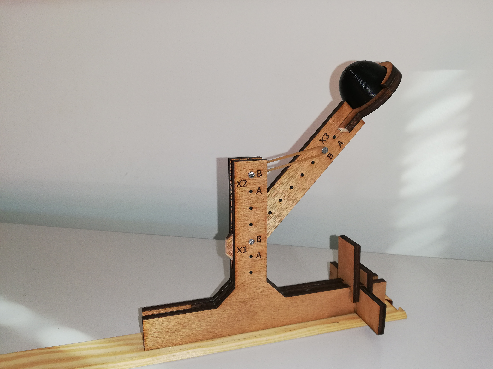
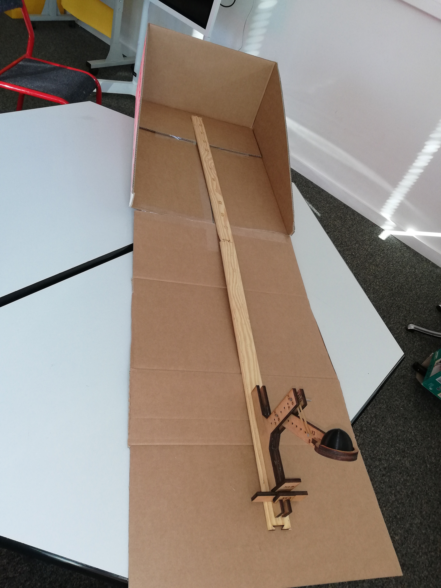

# Catapulte pour Taguchi

La catapulte est un support pédagogique pour illustrer les [plans d'expériences de Taguchi](https://fr.wikipedia.org/wiki/M%C3%A9thode_Taguchi).

## Méthode Taguchi

TODO

## Sources

* [pièces à découper au laser](catapulte.svg)
* [pièce à imprimer en 3D](bullet.stl)
* règles à graver  [partie 1](ruler-part1.svg), [partie 2](ruler-part2.svg)

## License

Comme indiqué dans le fichier [LICENCE](LICENCE), la majorité des documents sont sous [license Creative Commons BY 4.0](https://creativecommons.org/licenses/by/4.0/).
